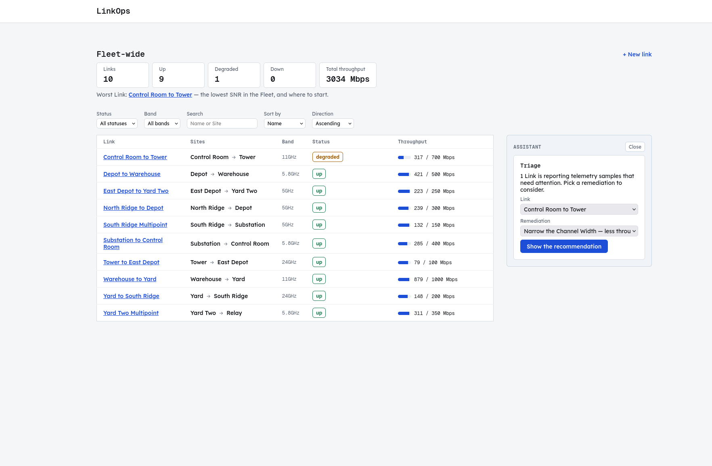
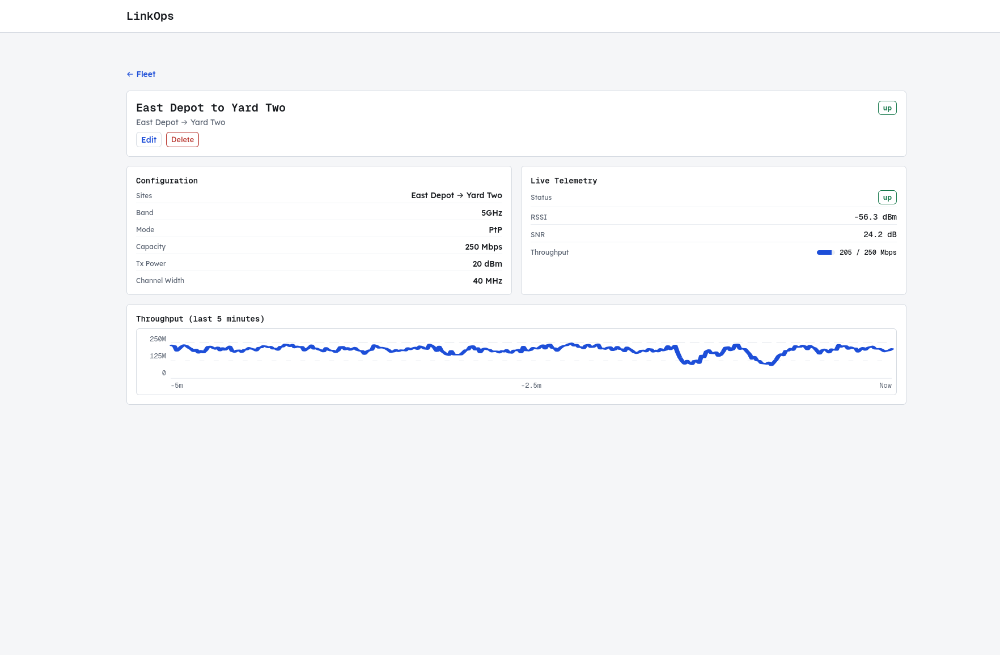
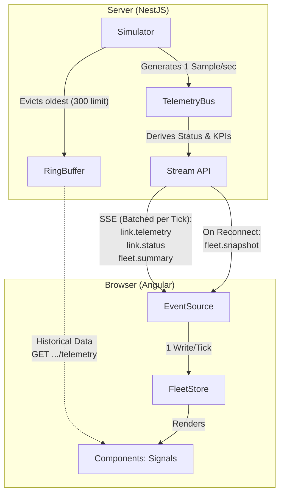

# LinkOps Console

## 1. What this is

An operator console for a fleet of point-to-point radio links. It shows live
status and throughput for every link, makes degraded links obvious, drills into
one link's telemetry, and edits link configuration. Telemetry comes from a
simulator inside the API — there is no hardware and no external service, and all
state lives in the API process's memory.



*The fleet view: the KPI header and worst-link callout, URL-driven filter and
sort controls, the live link table, and the assistant panel open on the right
with a triage surface the server described and the Console rendered.*



*The link detail view: configuration, live telemetry, and a hand-rolled SVG
sparkline — no chart library. Its five-minute window is exactly what the
server's ring buffer retains ([§12](#the-bounds-decided-rather-than-defaulted)),
so the widest view the UI offers is never wider than the data behind it.*

Deeper reading: [`CONTEXT.md`](./CONTEXT.md) for the domain glossary,
[`docs/adr/`](./docs/adr/) for the 15 decisions this build rests on, and
[`docs/specs/`](./docs/specs/) for the specifications it was built against.

## 2. Prerequisites

| Requirement | Version     | Where it is pinned                                            |
| ----------- | ----------- | ------------------------------------------------------------- |
| Node.js     | **24.18.0** | [`.nvmrc`](.nvmrc) — `nvm use` reads it                       |
| pnpm        | **11.21.0** | [`package.json`](package.json) `packageManager` — `corepack enable` reads it |

Nothing else. No database, no Docker, no message broker, no cloud service.

## 3. Install

```sh
git clone <repository-url> linkops
cd linkops
corepack enable                  # activates the pinned pnpm
nvm use                          # activates the pinned Node
pnpm install --frozen-lockfile
```

No build step comes first, and no library needs compiling ahead of the apps —
[`libs/`](./libs/) resolves through the path mappings in
[`tsconfig.base.json`](tsconfig.base.json). The only lifecycle script is
`prepare: husky`, which installs git hooks and does not affect how the app runs.

You do not need a `.env` file. Skip to [§5](#5-run-it) and start.

## 4. Configuration

Five variables, read through `@linkops/server/config`
([`libs/server/config`](libs/server/config)) rather than `process.env` directly.
[`.env.example`](.env.example) documents all of them with placeholder values;
copy it to `.env` (gitignored) to override anything locally.

| Variable                 | What it does                                                                 | Required?                                        | Default             | Example                 |
| ------------------------ | ---------------------------------------------------------------------------- | ------------------------------------------------ | ------------------- | ----------------------- |
| `API_PORT`               | Port the API listens on                                                      | Optional                                         | `3000`              | `3100`                  |
| `SWAGGER_UI_ENABLED`     | Mounts the Swagger explorer at `GET /api`. `GET /api/openapi.json` is served either way | Optional                              | `false`             | `true`                  |
| `ASSISTANT_PROVIDER`     | `stub` (ships in this repo, no key), `gemini`, or `anthropic` — selects the model client behind the `A2uiAgent` seam | Optional            | `stub`              | `gemini`                |
| `ASSISTANT_PROVIDER_KEY` | Credential for a real model provider. Never logged, never sent to the Console | Only when `ASSISTANT_PROVIDER` is not `stub`     | *(none)*            | `dummy-key-do-not-use`  |
| `ASSISTANT_MODEL`        | Model identifier when `ASSISTANT_PROVIDER=gemini`                            | Optional                                         | *(adapter default)* | `gemini-3.5-flash-lite` |

**The app runs fully with no credentials.** Every variable is individually
optional, so a fresh clone with no `.env` boots and works: the assistant panel
answers from the built-in stub agent. `ASSISTANT_PROVIDER`,
`ASSISTANT_PROVIDER_KEY` and `ASSISTANT_MODEL` are the A2UI bonus's variables —
set none of them and nothing is missing.

**The key cannot reach the browser.** It is read once at boot and used only
inside `libs/server/a2ui-agent` when building a provider client. It never
appears in a response body or a log, and `platform:console` libraries may not
import `platform:server` ones — a rule the linter enforces
([§7](#7-project-structure)). The panel calls `POST /api/agent/ui`; the model
call happens on the far side of that boundary.

**Validation checks coherence, not presence.** Three things stop the boot, each
naming its cause:

| Case | Example |
| ---- | ------- |
| A variable present but invalid | `API_PORT=nope`, `SWAGGER_UI_ENABLED=yes` |
| A provider selected without its key | `ASSISTANT_PROVIDER=gemini`, no `ASSISTANT_PROVIDER_KEY` |
| An unrecognised `ASSISTANT_*` variable | a typo'd key name the schema would otherwise silently never read |

`ASSISTANT_PROVIDER=anthropic` is accepted by the schema but ships no client,
and `selectA2uiAgent` refuses to fall back to the stub quietly — the one thing
an operator explicitly asked for should not be the one thing that silently did
not happen. It fails the boot instead, naming the seam.

## 5. Run it

```sh
pnpm start          # nx run-many -t serve -p api console assistant
```

That is the one command. Individually:

```sh
pnpm serve:api        # NestJS      http://localhost:3000
pnpm serve:console    # Angular     http://localhost:4200
pnpm serve:assistant  # MF remote   http://localhost:4201
```

| Surface          | URL                                                    | Notes                                                     |
| ---------------- | ------------------------------------------------------ | --------------------------------------------------------- |
| Console          | [localhost:4200](http://localhost:4200)                | **Open this one**                                          |
| Assistant remote | [localhost:4201](http://localhost:4201)                | Fetched by the Console on demand, not opened directly     |
| API              | [localhost:3000](http://localhost:3000)                | `API_PORT` moves it                                        |
| Swagger UI       | [localhost:3000/api](http://localhost:3000/api)        | Only when `SWAGGER_UI_ENABLED=true`                        |

The assistant panel is a separately served Module Federation remote, so
`apps/assistant` must be running for "Ask the assistant" to resolve — which is
why `pnpm start` serves all three. `pnpm serve:console` alone boots the Console
fine, but the panel will spin forever.

The Console's dev server proxies `/api` to the API
([`apps/console/proxy.conf.js`](apps/console/proxy.conf.js), reading the same
`API_PORT`), so the Console calls the same relative paths in development that it
calls in production. There is no CORS config because there is no cross-origin
request.

**What a working first load looks like:**

- **10 links**, from a fixed seed table — not random, so a screenshot and a test
  describe the same fleet
  ([`seed-links.ts`](libs/server/links-data-access/src/lib/seed-links.ts)).
- **Telemetry moves in under a second.** One sample per link per second.
- **KPI header:** 10 links, normally all 10 `up`, and a total throughput of
  roughly 3,000 Mbps across the fleet.
- Within the first few minutes a degradation episode usually claims one link: it
  turns `degraded` and becomes the worst link. That is the simulator working,
  not a fault. A link goes `down` only when no sample arrives for five seconds,
  which in practice means the API stopped.

## 6. Test it

```sh
pnpm test        # every project — nx run-many -t test
pnpm lint        # ESLint, including the module-boundary rules of §7
pnpm typecheck   # tsc --noEmit across every project
pnpm build       # production builds, with bundle budgets enforced
```

While developing, pass a filename fragment after `--`:

```sh
pnpm nx test shared-domain -- derive-status     # one spec file
pnpm nx test console-data-access                # one project
```

A fragment matching no file exits non-zero rather than passing silently.

**How long it takes.** A cold `pnpm test --skipNxCache` across all 17 projects
takes about **50 seconds** (49.0 s measured, all 17 green). A warm re-run takes
about **0.2 seconds** of task time — 17/17 cache hits — because the Nx cache
answers everything. CI always starts cold.

Nothing is skipped and no test sleeps. The SSE tests open a real HTTP connection
with `fetch` and an `AbortController`, because the behaviour under test is a
client that disconnects.

## 7. Project structure

An Nx workspace: **three thin app shells and fourteen libraries.** Apps wire
things together and own no domain logic.

```
linkops/
├── apps/
│   ├── api/                     NestJS shell — bootstrap and setup only
│   ├── console/                 Angular host shell — routes, providers, global styles
│   └── assistant/               Module Federation remote (4201), exposes AssistantPanel
├── libs/
│   ├── shared/                  platform:shared — imports no framework at all
│   │   ├── domain/              Link, TelemetrySample, FleetSummary, LinkId, deriveStatus,
│   │   │                        the SSE event catalogue, the error vocabulary. zod only.
│   │   └── a2ui-protocol/       The A2UI surface schema, shared by agent and renderer
│   ├── server/                  platform:server
│   │   ├── links-data-access/   LinkRepository + in-memory impl + the ten-link seed
│   │   ├── telemetry/           Simulator, RingBuffer, TelemetryBus, TelemetryPort
│   │   ├── config/              Environment schema and loader
│   │   ├── links-api/           REST controllers for links and the fleet summary
│   │   ├── stream-api/          GET /api/stream — the tick-to-events pipeline
│   │   ├── a2ui-agent/          A2uiAgent interface: stub and Gemini implementations
│   │   └── health/              No runtime code — holds the Nest DI and decorator-
│   │                            metadata guard (ADR-0002). There is no health endpoint.
│   └── console/                 platform:console
│       ├── data-access/         FleetStore, stream client, tick coalescer, HTTP clients
│       ├── ui/                  Presentational components + the A2UI surface renderer
│       ├── feature-fleet/       Fleet page: list, filters, KPI header, assistant wrapper
│       ├── feature-link-detail/ Detail page: sparkline, edit form, conflict handling
│       └── feature-assistant/   AssistantPanel — imported only by apps/assistant
├── docs/adr/                    15 ADRs
└── CONTEXT.md                   Domain glossary
```


**Where a new feature goes:** a new screen is a `feature` library under the
platform that renders it; the state it needs goes in that platform's
`data-access`; anything both platforms must agree on goes in `shared/domain` —
and therefore may not import a framework.

### The dependency rule, enforced by lint

Three tag axes
([ADR-0009](docs/adr/0009-three-tag-axes-platform-domain-type.md)), enforced by
`@nx/enforce-module-boundaries` in [`eslint.config.mjs`](eslint.config.mjs). A
violation fails `pnpm lint`, so the rule is a build failure rather than a
convention.

| Axis        | Values                                                 | Rule                                                                                                              |
| ----------- | ------------------------------------------------------ | ----------------------------------------------------------------------------------------------------------------- |
| `platform:` | `shared`, `server`, `console`                          | `shared` depends only on `shared`. `server` and `console` each depend on themselves and `shared`, never each other. |
| `type:`     | `app`, `feature`, `data-access`, `ui`, `domain`        | One direction: `app` → `feature` → (`data-access`, `ui`) → `domain`. Never back up, and **never feature → feature**. |
| `domain:`   | `platform`, `links`, `fleet`, `telemetry`, `assistant` | Organisational — names what a library is about.                                                                    |

`platform:shared` additionally bans `@nestjs/*`, `@angular/*` and `rxjs` as
external imports. That is what makes "domain logic independent of Nest and
Angular" a rule the linter checks rather than a claim in a README:
`deriveStatus` is testable without booting either framework because it *cannot*
import one. There are no cycles, because a cycle cannot be expressed under these
constraints.

Regenerate the graph with `pnpm nx graph` (`--file=graph.json` for a
machine-readable dump).

## 8. How it works



| Question | Answer |
| -------- | ------ |
| Where telemetry is generated | The `Simulator`, one sample per link per second (1 Hz) |
| How a sample reaches the browser | Simulator → `TelemetryBus` → `stream-api`, which batches the whole tick into one `link.telemetry` payload over SSE → the browser's `EventSource` → `FleetStore` |
| Where link status is derived | **Server only**, in `deriveStatus`. The client treats the wire status as authoritative, so a dropped stream can never masquerade as a dead link |
| Where client state lives | `FleetStore` — the browser's single source of truth. Exactly one write per tick, pushed to the UI through signals |
| What happens on reconnect | No replay. The server publishes a fresh `fleet.snapshot`; the client drops stale state and resynchronises from it |

Reasoning: [ADR-0004](docs/adr/0004-batched-per-tick-sse-framing.md) (batched
framing), [ADR-0005](docs/adr/0005-snapshot-on-connect-no-telemetry-replay.md)
(no replay).

### The Assistant remote

The triage panel is built and served as its own app (`apps/assistant`, port
4201) rather than compiled into the Console, using [Native
Federation](https://github.com/angular-architects/module-federation-plugin) —
Angular's esbuild-based successor to webpack Module Federation.

It is a **Component Remote**: the host never routes to it. `AssistantWrapper`
(`console/feature-fleet`) calls `loadRemoteModule('assistant', './Component')`
inside the Fleet route's existing `@defer` block once an operator clicks "Ask
the assistant", shows a spinner while the promise is pending, then mounts the
resolved component with `NgComponentOutlet`
([ADR-0015](docs/adr/0015-assistant-as-a-module-federation-remote.md)).

Three things are worth knowing about it:

- **Why a remote at all.** `@nx/enforce-module-boundaries` bans one
  `type:feature` library from importing another
  ([ADR-0011](docs/adr/0011-feature-composition-through-ui-and-data-access.md)),
  and that rule reads the *static* import graph. A `loadRemoteModule` call
  naming `'assistant'` by string creates no edge to see — the two are composed
  at runtime, not at build time.
- **What is shared, and why it must be.** Both `federation.config.mjs` files
  declare `@linkops/shared/domain` and `@linkops/console/data-access` as
  singletons. This is correctness, not optimisation: `console/data-access`
  defines `AssistantInvalidPayloadError`, and `AssistantSession` distinguishes
  it from a transport failure with `instanceof`. In two separate bundles those
  would be two distinct classes and the check would silently stop matching.
  `@angular-architects/native-federation` itself cannot be shared — it *is* the
  sharing mechanism, so `main.ts`'s bootstrap import of it necessarily runs
  before that mechanism exists
  ([ADR-0014](docs/adr/0014-programmatic-component-remotes-for-module-federation.md)).
- **Version skew.** Host and remote build from the same commit in the same
  `pnpm build`, with one deployment path, so the classic independent-deploy skew
  does not apply today. If this shipped on a device I would version the remote's
  exposed module against `shared/domain` (the wire contract) explicitly and have
  the host refuse to mount a remote whose contract version it does not
  recognise — degrading to a message inside the panel, never a broken shell.
  Silent mounting of a mismatched remote is the failure mode Module Federation
  makes easy and a device makes expensive.

## 9. API reference

The API is formally specified via OpenAPI, generated at runtime from the same
zod schemas the server validates with:

- **Swagger UI** at `GET /api` — set `SWAGGER_UI_ENABLED=true`.
- **Raw document** at `GET /api/openapi.json` — always served.

### REST

| Method | Path | Purpose |
| ------ | ---- | ------- |
| `GET`    | `/api/links`                        | List. Accepts `status`, `band`, `q`, `sort`, `dir` |
| `POST`   | `/api/links`                        | Create — `201` |
| `GET`    | `/api/links/:id`                    | One link with its telemetry snapshot — `404` if unknown |
| `PATCH`  | `/api/links/:id`                    | Partial update. Requires `version`; `409` on mismatch |
| `DELETE` | `/api/links/:id`                    | Delete — `204`, `404` if unknown |
| `GET`    | `/api/links/:id/telemetry?window=300` | Recent samples for the chart |
| `GET`    | `/api/fleet/summary`                | The `FleetSummary` KPI block — `total`, `up`, `degraded`, `down`, `totalThroughputMbps`, `worstLinkId` |
| `GET`    | `/api/stream`                       | SSE — see below |
| `POST`   | `/api/agent/ui`                     | A2UI: submit an action, receive the next surface |

### SSE — `GET /api/stream`

Events are typed in
[`stream-events.ts`](libs/shared/domain/src/lib/stream-events.ts). Every event
from one tick shares an `id:`.

| Event | When |
| ----- | ---- |
| `fleet.snapshot` | On connect, and on every reconnect |
| `link.telemetry` | Every tick — all links' samples, batched |
| `link.status`    | On a status transition |
| `fleet.summary`  | Every tick |
| `link.created` / `link.updated` / `link.deleted` | Configuration changes |

```
event: link.telemetry
data: {"samples":[{"linkId":"...","ts":"2026-08-05T09:00:01.000Z","rssiDbm":-62,"snrDb":21,"throughputMbps":184}]}

event: link.status
data: {"linkId":"...","status":"degraded","previous":"up"}
```

### Error envelope

One shape for every failure. The HTTP status carries the class, the `code`
carries the meaning, and the `code` union in `shared/domain` lets a client
switch on it exhaustively.

```json
{ "error": { "code": "LINK_VERSION_CONFLICT",
             "message": "Link was modified by someone else",
             "details": { "currentVersion": 7 } } }
```

## 10. Common tasks

**Add a field to a link**

1. Add it to `linkSchema` in
   [`libs/shared/domain/src/lib/link.ts`](libs/shared/domain/src/lib/link.ts).
2. If a client may write it, add it to `linkCreateSchema` and `linkPatchSchema`
   in the same library.
3. Compile. The compiler names every site that must change.
4. Add it to the seed table in `seed-links.ts` and to the form in
   `console/feature-link-detail`.

One edit propagates: the server's validation pipe, the OpenAPI document and the
Console's form validators all read that schema
([ADR-0006](docs/adr/0006-shared-zod-schema-as-the-contract.md)).

**Add an endpoint**

1. Define request and response schemas in `shared/domain`.
2. Add the handler to the controller in `server/links-api`.
3. Return the repository's result type; the controller maps a result arm to an
   HTTP status rather than inventing one.
4. A new failure needs a new member of the `code` union in `shared/domain`.

**Add a UI panel**

1. Presentational component goes in `console/ui` — inputs and outputs, no
   injected data-access service.
2. Compose it inside a `feature` library; only that layer reaches
   `data-access`.
3. If it needs its own screen, make a new `feature` library. A feature importing
   another feature is a lint error
   ([ADR-0011](docs/adr/0011-feature-composition-through-ui-and-data-access.md)).

**Add a test**

1. Put the `*.spec.ts` beside the code. Every project runs Vitest through the
   same runner
   ([ADR-0002](docs/adr/0002-unified-vitest-runner-and-swc-decorator-metadata.md)),
   so no configuration is needed.
2. Pure logic in `shared/domain` uses no framework — that library cannot import
   one.
3. A new `LinkRepository` implementation runs against
   [`link-repository.contract.ts`](libs/server/links-data-access/src/lib/link-repository.contract.ts),
   which holds the interface's behaviour once for every implementation. Do not
   write fresh tests for it.
4. Run it with `pnpm nx test <project> -- <fragment>`.

## 11. Troubleshooting

| Symptom | Cause and fix |
| ------- | ------------- |
| `EADDRINUSE` on 3000 / 4200 / 4201 | The API / Console / Assistant remote. Move the API with `API_PORT=3100 pnpm start` — the Console's proxy reads the same variable, so both follow. Move the Console with `pnpm nx serve console --port 4300`. |
| The stream connects but nothing updates | A reverse proxy is buffering the response; an SSE stream never ends, so a proxy that waits for the end waits forever. `GET /api/stream` sets `X-Accel-Buffering: no`, `Content-Type: text/event-stream` and `Cache-Control: no-cache` ([`stream.controller.ts`](libs/server/stream-api/src/lib/stream.controller.ts)) — nginx obeys this; for another proxy, disable buffering yourself. If the Console shows *disconnected* instead, the API is down; it reconnects unaided and resynchronises from a fresh snapshot. |
| The assistant panel spins forever | `apps/assistant` is not running. Use `pnpm start`, or add `pnpm serve:assistant`. |
| The boot fails naming an environment variable | Working as designed — validation tests coherence and the message names what is incoherent ([§4](#4-configuration)). Deleting `.env` always returns you to a valid state. |
| A build looks impossibly stale | Nx caches on task inputs. `pnpm nx reset` clears it; `--skipNxCache` bypasses it for one command. After a dependency change, remove `.angular/` and `dist/`. |

## 12. Decisions, gaps and next steps

### Three decisions I would defend in a review

**1. The stream is batched per tick, not per sample.**
One `link.telemetry` event carries every link's sample for that tick
([ADR-0004](docs/adr/0004-batched-per-tick-sse-framing.md)). *Rejected: one
event per sample* — the shape the brief's example suggests, and simpler on the
server. It moves the cost to the client: at N links that is N messages, N parses
and N potential change-detection passes per second, so the brief's own
requirement ("coalesce or throttle so the UI is not re-rendered once per message
per link") becomes something the client has to undo. Batching makes the
guarantee structural: **one tick is one store write**, at ten links or ten
thousand. The trade-off is that a batched frame is all-or-nothing — a client
that wants one link still receives the fleet, which is the bottleneck below.

**2. One zod schema is the contract, on both sides of the wire.**
`linkSchema` and its create/patch derivatives live in `shared/domain` and drive
the NestJS validation pipe, the OpenAPI document and the Console's form
validators ([ADR-0006](docs/adr/0006-shared-zod-schema-as-the-contract.md)).
*Rejected: class-validator decorators on server DTOs plus hand-written Angular
validators* — the conventional NestJS choice. It states every rule twice, in two
languages that cannot be diffed, and they drift silently; the failure mode is a
client that accepts what the server rejects, which surfaces as a support ticket
rather than a test failure. `capacityMbps` is 10–1000 in exactly one place. The
cost was a real dependency, `nestjs-zod`, to bridge zod into Nest's pipe and
Swagger — accepted deliberately.

**3. The repository signature enforces the version check.**
`LinkRepository` exposes `update(id, patch, expectedVersion)` rather than a
generic `save(link)`
([ADR-0008](docs/adr/0008-repository-interface-carries-the-version-check.md)).
*Rejected: checking the version in the service layer, then calling
`save(link)`* — which is neither atomic (a race opens between the read and the
write) nor enforceable (it relies on a developer remembering). Requiring
`expectedVersion` in the signature makes a write that skips the check
unexpressible: the compiler rejects it. The repository owns atomicity and
returns structured results (`StaleVersion`, `DuplicateName`) that the controller
maps to 409 or 400, rather than throwing ambiguous exceptions.

### Where this design breaks at 10,000 links

At 10,000 links the system pushes roughly **1 MB of JSON per second** over SSE.
8 Mbps is not a network problem on a LAN — the bottleneck is the browser's main
thread.


1. **DOM and rendering.** 10,000 table rows updated at 1 Hz freezes the tab.
2. **Parse and GC churn.** Parsing 1 MB and allocating 10,000 objects every
   second causes heavy garbage-collection stutter.

**The fix, and what it costs.** Virtual scrolling
(`@angular/cdk/scrolling`) so only the ~30 visible rows exist in the DOM —
`@defer` is the wrong tool here, since it lazy-loads JS chunks rather than
recycling DOM nodes. Then a **viewport-aware subscription** to fix the churn:
the client tells the server which links are visible (updating on scroll, filter
and sort) and the server streams `link.telemetry` and `link.status` only for
those, while `fleet.summary` stays unconditional so the KPI header remains
accurate for the whole fleet.

### The bounds, decided rather than defaulted

| Bound | Value | Why |
| ----- | ----- | --- |
| Ring buffer per link | **300 samples** (5 min at 1 Hz) | Matches `DEFAULT_TELEMETRY_WINDOW`, so the widest view the UI offers is exactly what is retained. Capacity-bounded, not window-bounded: a buffer sized to whatever window a client *might* ask for grows with fleet size and the most extravagant request ever made — the unbounded growth the ring buffer exists to prevent. A client asking for an hour gets the five minutes that exist, never an error, never padding ([ADR-0010](docs/adr/0010-telemetry-retention-is-capacity-bounded.md)). |
| Console history | **`HISTORY_CAP`**, the same number | The detail view loads its window once and appends live samples. An unbounded append would grow with how long a screen stayed open, reopening on the client the exact leak the server closed. *Rejected: refetching per tick* — one HTTP round trip per second per open detail view, rebuilding what the stream already delivers. |

### Measured, not asserted

| What | Number | Conditions |
| ---- | ------ | ---------- |
| Per-tick store write | **0.2 ms median / 0.3 ms p95** | 60 ticks, ten-link seed fleet, headless Chrome, 2026-08-16. A re-run on a machine with a coarser `performance` clock reproduced it at whole-millisecond resolution (0 ms median, 1 ms p95) — the same result through a blunter instrument. |
| Console app code | **322 kB raw / 97 kB gzip** | Gated: 500 kB warn, 1 MB error. `main`, `polyfills`, `styles` and this app's own route chunks — what a Console change actually moves. |
| Shared infrastructure | **1,061 kB raw / 261 kB gzip** | Reported, not gated: Native Federation's shared-dependency bundles (`@angular/core` 364 kB, `zod` 385 kB, `@angular/router` 121 kB, …). A one-time, content-hashed, cacheable cost paid per browser rather than per visit, and not something a feature change can shrink. |
| Total first load | 1,450 kB raw / **421 kB gzip** | Informational. |

Getting a number worth trusting took two wrong attempts — summing only files
named in `index.html` (which misses the federation bundles entirely), then
classifying by filename (which cannot tell the default route's chunk from a
genuinely deferred one). [`tools/verify-bundle-budget.mjs`](tools/verify-bundle-budget.mjs)
stopped guessing: it serves the real gzipped production build, drives a real
headless browser to `/`, and sums what every response actually carried. Run it
with `nx run console:verify-bundle-budget`; CI runs the same script and posts
the same breakdown on every PR.

`zod` being the largest single line is the most surprising result: a
shared-dependency bundle builds from the package's own entry point, not from
what this workspace calls, so it ships zod's whole public API. Dropping it from
`shared` was tried on the theory it would tree-shake — it did not (zod resists
DCE wherever it is bundled), and it only stopped the bundle being deduplicated
across host and remote. Reverted.

### What I deliberately did not build

- **Parts of the A2UI spec.** Built against the [A2UI v1.0
  candidate](https://a2ui.org/specification/v1.0-a2ui/) with a renderer this
  repo owns rather than `@a2ui/angular` — which cannot be installed here anyway
  (`@a2ui/angular@0.10.5` peer-depends `@angular/core: ^21.2.5`; this client is
  on Angular 22) and would be the wrong shape regardless: what is needed is a
  mapping from an untrusted agent-authored payload onto a whitelist of
  components *we* control, and a general-purpose renderer is the opposite of a
  whitelist ([ADR-0007](docs/adr/0007-own-a2ui-renderer.md)).
  **Covered:** zod validation of the whole payload before anything touches it, a
  component whitelist with a labelled fallback for unknown types, text through
  interpolation only (no `innerHTML`, no `bypassSecurityTrust*`), depth and
  component-count caps, cycle detection, prototype-pollution guards on
  JSON-Pointer segments.
  **Skipped:** markdown in `Text` (it needs a sanitizer, and a sanitizer is a
  new attack surface — the safe subset is documented instead),
  `callRendererFunction`, `agentFunctionResponse`, and streaming partial
  messages.
- **Virtual scrolling.** At ten links, thirty DOM rows cost less than the
  machinery to recycle them. It is the first thing the 10,000-link analysis
  reaches for — which is the point: it fixes a problem this fleet does not have,
  and it is the first thing I would build with another day
  ([below](#what-another-day-buys-in-order)).
- **End-to-end tests.** The 409 conflict resolution and delete-while-streaming
  are covered at the HTTP and store layers separately, but never end to end.

### What another day buys, in order

1. **Virtual scrolling on the fleet list** (`@angular/cdk/scrolling`), so only
   the ~30 visible rows exist in the DOM. It is the half of the 10,000-link fix
   that needs no protocol change, which is what makes it first: it is entirely
   client-side, and it removes the freeze before the churn.
2. **Scope the stream to what a client is watching** — the other half, and the
   first change that touches the wire. Additive: a subscribe message naming
   visible link ids, with `fleet.summary` still unconditional. Virtual scrolling
   is what makes it cheap to build, since the viewport already knows which link
   ids those are.
3. **An e2e pass over the two round trips only integration can prove** — the 409
   conflict and delete-while-streaming.

### Bonus coverage

✅ delivered inside the four-day time box · 🟡 partial, finished after it

| | # | Bonus | Status |
| - | - | ----- | ------ |
| ✅ | **B1** | Nx monorepo | Three apps, fourteen libraries, three enforced tag axes ([§7](#7-project-structure)) |
| ✅ | **B2** | A2UI protocol panel | Deterministic stub and Gemini integration behind a server-rendered UI protocol (`libs/shared/a2ui-protocol`); own renderer with a component whitelist |
| ✅ | **B2a** | Credentials for A2UI | Boot-time coherence validation, gitignored `.env`, committed `.env.example`, key never leaves the server, stub selected automatically when absent ([§4](#4-configuration)) |
| ✅ | **B3** | Zoneless + signal-first | No zone.js in `package.json` and no `polyfills` entry, so nothing patches the browser's async APIs and there is no manual `tick()`. What it took was upstream: coalescing to one store write per tick means a 1 Hz fleet causes one change-detection pass per second, not one per link per second. `EventSource` is injected behind the `EVENT_SOURCE` token so tests can drive it without a zone to flush |
| 🟡 | **B4** | Module Federation | **Partial — implemented inside the time box, finished on day five.** The Assistant panel is a Component Remote (`apps/assistant`), fetched at runtime inside the Fleet route's `@defer` block ([§8](#8-how-it-works)). The extraction itself was quick, because the seam was already there: the renderer was a `ui` component and its state a `data-access` service, so nothing had to be untangled. What I held off on was merging it — the initial bundle appeared to be ~1.4 MB, over the 1 MB error budget, and I was not going to put a bonus on `main` at the cost of a gate. Resolving that is the part that ran past day four: the measurement was wrong, not the build ([above](#measured-not-asserted)), and app code is 322 kB. Count the remote as built in time and the optimisation work behind it as late |
| ✅ | **B5** | Performance for an embedded host | Bundle budgets that fail the build, plus real numbers with their conditions ([above](#measured-not-asserted)) |
| ✅ | **B6** | Engineering hygiene | 15 ADRs, GitHub Actions running lint / typecheck / test / build, conventional commits enforced by commitlint and husky |

### How I used AI tools

This project was built using AI-assisted development. AI acted as a helpful pair programmer, allowing me to accelerate the work and explore different approaches. While AI tools generated code and provided suggestions, I reviewed the diffs and tried my best to ensure the final implementation met the project's goals.

AI was used throughout, with different models taking on different tasks: **Opus 5** for exploring architectural decisions, **Sonnet 5** for implementation assistance, **Gemini 3.1 Pro** for research and documentation lookup, and multiple specialised sub-agents running in parallel to manage different domain contexts. Here are the main ways AI contributed:

| Use | What it looked like |
| --- | ------------------- |
| **Scaffolding** | Generating library skeletons, controllers, spec files and boilerplate to help get things moving faster |
| **Documentation lookups** | Quickly answering "what does this framework actually do on this version" based on real documentation. [ADR-0001](docs/adr/0001-toolchain-and-version-compatibility.md)'s compatibility matrix and the `@a2ui/angular` peer-dependency check were aided by this |
| **Role-playing** | The AI took on different roles to assist the work: proposing structures, drafting code, helping with reviews, and acting as a sounding board for design ideas |
| **Design review** | Custom skills helped review decisions and highlight potential alternatives before they were finalized in the ADRs |

Working with the AI models was a collaborative process. We discussed various designs iteratively, and the outcomes of those discussions helped shape the final ADRs.

The methodology was spec-driven: requirements distilled into [specs](./docs/specs/), broken into sequential [tracer-bullet stories](https://github.com/ramvignesh-b/linkops/issues?q=is%3Aissue+is%3Aclosed), then implemented test-first.

Every correction is logged in [`docs/decisions/ai-collaboration.md`](docs/decisions/ai-collaboration.md). Here are a few notable instances where we took a different path than initially suggested:

| Entry | The tool suggested | We decided otherwise because |
| ----- | ------------------ | ---------------------------- |
| 10 | Drop OpenAPI to save time, assuming class-based DTOs | `nestjs-zod` generates the document from our existing schemas without much extra effort |
| 27 | Delete `TelemetryBus` as YAGNI | It serves as a helpful boundary separating the simulator from the SSE layer |
| 35 | Patch the `GeminiAgent` prompt again for valid A2UI output | Rather than tweaking prompts, we found a more structural solution in [ADR-0012](docs/adr/0012-the-model-recommends-the-server-renders.md): the model recommends, the server renders |
