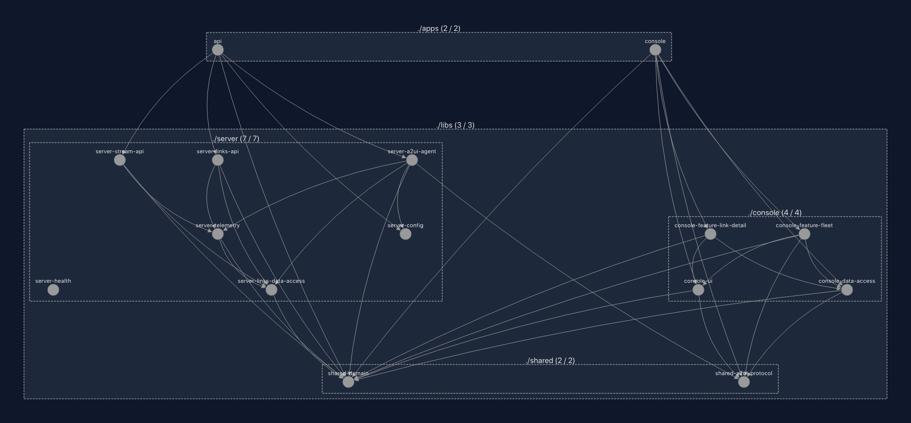
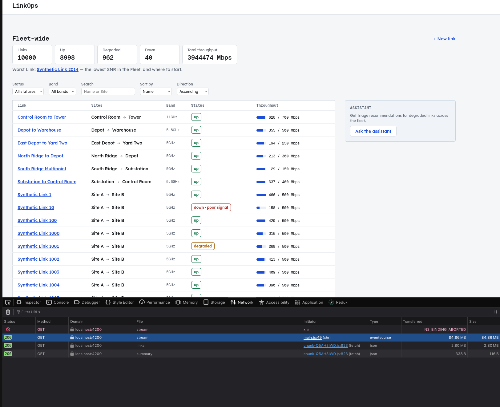

# LinkOps Console

## 1. What this is

An operator console for a fleet of point-to-point radio links: live status and
throughput for every link, degraded ones visible immediately, drill-down into
one link's telemetry, and link configuration editing. Telemetry comes from a
simulator inside the API, there is no hardware and no external service.

See [`CONTEXT.md`](./CONTEXT.md) for the project's glossary,
[`docs/adr/`](./docs/adr/) for the architectural decisions this build rests on, and 
[`docs/specs/`](./docs/specs/) for the original specifications this was built against.

## 2. Prerequisites


| Requirement | Version     | Where it is pinned                                                          |
| ----------- | ----------- | --------------------------------------------------------------------------- |
| Node.js     | **24.18.0** | [`.nvmrc`](.nvmrc), `nvm use` reads it                                      |
| pnpm        | **11.21.0** | [`package.json`](package.json) `packageManager`, `corepack enable` reads it |


The application needs nothing else. It uses no database, no Docker, no message
broker and no cloud service. All state stays in the memory of the API process
for as long as that process runs.

## 3. Install

```sh
git clone <repository-url> linkops
cd linkops
corepack enable          # activates the pnpm version pinned in package.json
nvm use                  # activates the Node version pinned in .nvmrc
pnpm install --frozen-lockfile
```

NOTE: No build step comes before these commands. There is no postinstall step,
and no library must be compiled first. The libraries in `libs/` are resolved
through the path mappings in [`tsconfig.base.json`](tsconfig.base.json), so the
API build and the Console build compile them.

NOTE: The only lifecycle script is `prepare: husky`. It installs the git hooks.
It has no effect on how the application runs.

You do not need a `.env` file. Read [§4](#4-configuration) for the reason, or go
to [§5](#5-run-it) and start the application now.

## 4. Configuration

Five environment variables, read through `@linkops/server/config` rather
than `process.env` directly (see [`libs/server/config`](libs/server/config)),
and validated at boot for **coherence, not presence**: every one of them is
individually optional, so a fresh clone with no `.env` file and no key
starts and answers through the stub. See
[`.env.example`](.env.example), copy it to `.env` (gitignored) to override
any of these locally; every value there is a placeholder, never a real key.


| Variable                 | What it does                                                                                                                                                                         | Required?                                                          | Default             | Example                 |
| ------------------------ | ------------------------------------------------------------------------------------------------------------------------------------------------------------------------------------ | ------------------------------------------------------------------ | ------------------- | ----------------------- |
| `API_PORT`               | The port the API listens on                                                                                                                                                          | Optional                                                           | `3000`              | `3100`                  |
| `SWAGGER_UI_ENABLED`     | Mounts the interactive Swagger explorer at `GET /api` when `true`. `GET /api/openapi.json` is served either way, see [OpenAPI document](#openapi-document)                           | Optional                                                           | `false`             | `true`                  |
| `ASSISTANT_PROVIDER`     | `stub` needs no key and is what ships in this repository. `gemini` and `anthropic` each select a real model client behind the `A2uiAgent` seam (`libs/server/a2ui-agent`), see below | Optional                                                           | `stub`              | `gemini`                |
| `ASSISTANT_PROVIDER_KEY` | The credential for a real model provider. Never logged and never sent to the Console, the Console has no knowledge that a provider concept exists at all                             | Conditional, required only when `ASSISTANT_PROVIDER` is not `stub` | *(none)*            | `dummy-key-do-not-use`  |
| `ASSISTANT_MODEL`        | The model identifier used when `ASSISTANT_PROVIDER=gemini`                                                                                                                           | Optional                                                           | *(adapter default)* | `gemini-3.5-flash-lite` |


**No credentials required.** An empty environment is coherent by
construction, nothing here is *required*, so the application will
boot and function properly on a fresh clone without a `.env` file. The optional A2UI integration relies on these variables: `ASSISTANT_PROVIDER`, `ASSISTANT_PROVIDER_KEY` and `ASSISTANT_MODEL` select
and configure a real model. **Set none of them and the application is fully
functional**, the assistant panel answers from the built-in stub agent,
which is what ships in this repository and what runs on a clean machine.

**Server-side credential usage.** It is read once, at boot, by
`libs/server/config`, and used only inside `libs/server/a2ui-agent` when it
builds a provider client. It is never included in a response body, never logged,
and cannot reach the Angular bundle: `platform:console` libraries may not import
`platform:server` ones, which [§7](#7-project-structure) enforces at lint time,
and the Console has no configuration surface where a provider or a key could
appear. The panel calls `POST /api/agent/ui`; the model call happens on the far
side of that boundary.

**Strict environment validation.** Three things stop the boot, each
naming what caused it rather than leaving a stack trace to read:

- a variable present but invalid, `API_PORT=nope`, `SWAGGER_UI_ENABLED=yes`;
- `ASSISTANT_PROVIDER=gemini` or `ASSISTANT_PROVIDER=anthropic` with
`ASSISTANT_PROVIDER_KEY` absent or empty, the two are coherent together
or not at all;
- an unrecognised variable that starts with `ASSISTANT_`, the near-miss
that would otherwise leave an operator on the stub while believing they
had configured a model, e.g. a typo'd key name that the schema silently
never reads.

**Explicit provider support.**
`ASSISTANT_PROVIDER=gemini` with its key present builds `GeminiAgent`
(`libs/server/a2ui-agent`): it pre-filters the Fleet down to the Links the
shared presenter already considers degraded, and asks Gemini which of them to
look at first, which Remediation to consider, and why. The Surface carrying
that answer is built here, by the same builders the stub uses, the model
supplies the judgement and the words, never the document, which is what makes
a blank panel unexpressible rather than merely unlikely. The reasoning, and
the three failure modes that produced it, are recorded in
[ADR-0012](docs/adr/0012-the-model-recommends-the-server-renders.md).
`ASSISTANT_PROVIDER=anthropic` with its key present is
equally coherent, the schema accepts it, but no model client ships for it,
and the configuration (`selectA2uiAgent` in `libs/server/a2ui-agent`) refuses to fall
back to the stub quietly. Silently downgrading would make every rule above
pointless: the one thing an operator explicitly asked for would be the one
thing that silently did not happen. The boot fails instead, with a message
naming the seam and pointing at `ASSISTANT_PROVIDER`.

## 5. Run it

*(Optional)* Copy the example environment file to `.env` to configure your API keys or override defaults:

```sh
cp .env.example .env
```

To start the API, the Console and the Assistant remote together, run this
command:

```sh
pnpm start          # nx run-many -t serve -p api console assistant
```

To start each side on its own, run one of these commands:

```sh
pnpm serve:api        # NestJS on http://localhost:3000
pnpm serve:console    # Angular dev server on http://localhost:4200
pnpm serve:assistant  # Assistant remote on http://localhost:4201
```


| Surface          | URL                                                    | Notes                                                                                         |
| ---------------- | ------------------------------------------------------ | --------------------------------------------------------------------------------------------- |
| Console          | [http://localhost:4200](http://localhost:4200)         | Open this one                                                                                 |
| Assistant remote | [http://localhost:4201](http://localhost:4201)         | Fetched by the Console on demand, not opened directly. See [§8](#8-how-it-works)               |
| API              | [http://localhost:3000](http://localhost:3000)         | `API_PORT` moves it                                                                           |
| Swagger UI       | [http://localhost:3000/api](http://localhost:3000/api) | Only when `SWAGGER_UI_ENABLED=true`. The raw document at `/api/openapi.json` is always served |

NOTE: The Assistant panel is a separately built and served Module Federation
remote, so `apps/assistant` has to be running for "Ask the assistant" to
resolve — which is why `pnpm start` serves all three. `pnpm serve:console`
on its own boots the Console fine, but the panel will spin and never load.


The dev server of the Console sends `/api` to the API through a proxy
([`apps/console/proxy.conf.js`](apps/console/proxy.conf.js), which reads the same
`API_PORT`). The Console therefore calls the same relative paths in development
that it calls when the API serves it in production. There is no CORS
configuration, because there is no cross-origin request.

**Expected initial state.** The fleet has ten links. The seed
table is fixed, not random, so a screenshot and a test describe the same fleet
([`seed-links.ts`](libs/server/links-data-access/src/lib/seed-links.ts)).

Telemetry starts in less than one second. The simulator makes one sample for
each link every second. The KPI header shows a total of 10, normally with all
ten links `up`, and an average throughput in the low hundreds of Mbps. The
targets of the simulator are chosen so that a fleet reads healthy from its first
tick.

In the first minutes, a degradation episode usually claims one link. That link
moves to `degraded` and becomes the worst link. This is the simulator at work,
not a fault. A link becomes `down` only when no sample arrives for five seconds,
which in practice means that the API stopped.

## 6. Test it

```sh
pnpm test        # every project, nx run-many -t test
pnpm lint        # ESLint, with the module-boundary rules of §7
pnpm typecheck   # tsc --noEmit across every project
pnpm build       # production builds, with the bundle budgets enforced
```

To run one spec file while you develop, give Vitest a fragment of the filename
after `--`:

```sh
pnpm nx test shared-domain -- derive-status     # one spec file
pnpm nx test console-data-access                # one project
```

A fragment that matches no file exits with a non-zero code. It does not pass
silently.

**How long the suite takes.** A cold run of `pnpm test --skipNxCache` across 15
projects takes about **50 seconds** (51.5 s measured on the machine named in
[§8](#8-how-it-works)). A second run takes about **0.2 seconds**, because the Nx
cache answers every task. Both numbers are correct, and the cache decides which
one you see. CI starts cold and therefore sees the first one.

Nothing is skipped and no test sleeps. The SSE tests open a real HTTP connection
with `fetch` and an `AbortController`, because the behavior under test is a
client that disconnects.

## 7. Project structure

An Nx workspace: **two thin app shells and thirteen libraries.** The apps wire
things together and own no domain logic.

```
linkops/
├── apps/
│   ├── api/                     NestJS shell, handles bootstrap and setup only
│   └── console/                 Angular shell, routes, providers, global styles
├── libs/
│   ├── shared/                  platform:shared, imports no framework at all
│   │   ├── domain/              Link, TelemetrySample, FleetSummary, LinkId, deriveStatus,
│   │   │                        the SSE event catalogue, the error vocabulary. zod only.
│   │   └── a2ui-protocol/       The A2UI surface schema, shared by the agent and the renderer
│   ├── server/                  platform:server
│   │   ├── links-data-access/   LinkRepository + in-memory implementation + the ten-link seed
│   │   ├── telemetry/           Simulator, RingBuffer, TelemetryBus, TelemetryPort
│   │   ├── config/              The environment schema and its loader
│   │   ├── links-api/           REST controllers for links and the fleet summary
│   │   ├── stream-api/          GET /api/stream, the tick-to-events pipeline
│   │   ├── a2ui-agent/          The A2uiAgent interface: stub and Gemini implementations
│   │   └── health/              Liveness
│   └── console/                 platform:console
│       ├── data-access/         FleetStore, the stream client, the tick coalescer, HTTP clients
│       ├── ui/                  Presentational components, no injection of a data-access service
│       ├── feature-fleet/       The fleet page: list, filters, KPI header, assistant panel
│       └── feature-link-detail/ The detail page: sparkline, edit form, conflict handling
├── docs/adr/                    13 ADRs, the decisions worth defending
└── CONTEXT.md                   The domain glossary
```



**Where a new feature goes:** a new screen is a `feature` library under the
platform that renders it; the state it needs goes in that platform's
`data-access`; anything both platforms must agree on goes in `shared/domain`, and
therefore may not import a framework.

### The dependency rule, enforced by lint

Three tag axes ([ADR-0009](docs/adr/0009-three-tag-axes-platform-domain-type.md)),
enforced by `@nx/enforce-module-boundaries` in
[`eslint.config.mjs`](eslint.config.mjs). A violation fails `pnpm lint`, so the
rule is a build failure rather than a convention:


| Axis        | Values                                                 | Rule                                                                                                                                                                             |
| ----------- | ------------------------------------------------------ | -------------------------------------------------------------------------------------------------------------------------------------------------------------------------------- |
| `platform:` | `shared`, `server`, `console`                          | `shared` may depend only on `shared`. `server` and `console` may each depend on themselves and on `shared`, never on each other. This keeps the code domains strictly separated. |
| `type:`     | `app`, `feature`, `data-access`, `ui`, `domain`        | Dependencies point one way: `app` → `feature` → (`data-access`, `ui`) → `domain`. Never back up the chain, and **never feature → feature**.                                      |
| `domain:`   | `platform`, `links`, `fleet`, `telemetry`, `assistant` | Organisational: it names what a library is about, and keeps the other two axes from being the only vocabulary.                                                                   |


`platform:shared` additionally bans `@nestjs/*`, `@angular/*` and `rxjs` as
external imports, which is what makes "domain logic independent of Nest and
Angular" a rule the linter checks rather than a claim in a README. `deriveStatus`
is unit-testable without booting either framework because it cannot import one.

Regenerate the graph with `pnpm nx graph` (add `--file=graph.json` for a
machine-readable dump). Every edge in it points down the table above; there are
no cycles, because a cycle cannot be expressed under these constraints.

### Where things live

A summary of the library responsibilities:

- `shared/domain`: Wire schemas, error vocabulary, and the pure `deriveStatus` function.
- `server/*`: The HTTP surface, the in-memory `LinkRepository`, the telemetry `Simulator` and `RingBuffer`, and the A2UI provider integrations.
- `console/data-access`: The `FleetStore` state management, stream coalescing, and HTTP clients.
- `console/ui`: Presentational components and the A2UI surface renderer.
- `console/feature-*`: Routed pages composing UI and data-access.
- `console/feature-assistant`: The triage panel itself, `AssistantPanel` — the
  Assistant remote's one exposed component. Imported only by `apps/assistant`,
  never by `console/feature-fleet`; see [§8](#8-how-it-works).
- `apps/assistant`: The Assistant remote — a separately built and served
  Angular application (port 4201) whose only job is exposing `AssistantPanel`.

## 8. How it works

Data flows from a central simulator to the client in a unidirectional pipeline:

```text
  Simulator ── one Sample per Link, every second (1 Hz)
      │
      ├──► RingBuffer ── 300 Samples per Link, oldest evicted
      │        └──► TelemetryPort ──► GET /api/links/:id/telemetry
      │
      └──► TelemetryBus ──► stream-api ─┬─ one batched link.telemetry frame per Tick
                                        ├─ Roster diff vs the previous Tick:
                                        │  link.created / updated / deleted / status
                                        └─ fleet.summary
                                              │
                                    GET /api/stream (SSE)
                                              │
                                          EventSource
                                              │
                                    FleetStore, one write per Tick
                                              │
                                     signals ──► fleet page, detail page
```

- **Simulator**: Generates 1 Sample per Link per second.
- **RingBuffer**: Retains the last 300 Samples per Link (capacity-bounded).
- **SSE Stream**: Publishes one `link.telemetry` event per tick containing all new samples, collapsing N events into a single store write for the client.
- **Status derivation**: Runs server-side only via `deriveStatus`. The client treats the received wire status as authoritative, ensuring dropped streams don't masquerade as dead links.
- **Reconnection**: The client receives a fresh `fleet.snapshot` upon reconnect rather than replaying missed events.

### The Assistant remote

The triage panel is built and deployed as its own application
(`apps/assistant`, port 4201) rather than compiled into the Console
(`apps/console`, port 4200), using [Native
Federation](https://github.com/angular-architects/module-federation-plugin) —
Angular's esbuild-based successor to webpack Module Federation, and Nx's own
recommended replacement for its now-deprecated Angular Module Federation
generators on this Nx version. `apps/console` reads
`public/federation.manifest.json` at startup and registers `assistant` as a
name it can ask for, and nothing more, until an operator actually asks for it.

This is a **Component Remote**: the host never routes to the Assistant or
renders it on a URL — `AssistantWrapper` (`console/feature-fleet`) calls
`loadRemoteModule('assistant', './Component')` directly, inside the Fleet
route's existing `@defer` block, once an operator clicks "Ask the assistant".
It shows an explicit spinner while that promise is pending, then mounts the
resolved component with `NgComponentOutlet`. See
[ADR-0015](docs/adr/0015-assistant-as-a-module-federation-remote.md).

**Why a remote at all**, rather than `console/feature-fleet` importing a
`console/feature-assistant` library directly: `@nx/enforce-module-boundaries`
bans one `type:feature` library from importing another
([ADR-0011](docs/adr/0011-feature-composition-through-ui-and-data-access.md)),
and that rule reads the static import graph. A `loadRemoteModule` call naming
`'assistant'` by string is not an import of `@linkops/console/feature-assistant`
at all, so there is no edge for the rule to see — the two are composed at
runtime, not at build time.

**What is shared, and why it has to be:** both `federation.config.mjs` files
declare `@linkops/shared/domain` and `@linkops/console/data-access` as
singletons (`sharedMappings`, alongside the framework packages `shareAll`
already covers). This is correctness, not optimisation: `console/data-access`
defines `AssistantInvalidPayloadError`, and `AssistantSession` tells it apart
from a transport failure with `instanceof`. Built into two separate bundles,
that would be two distinct classes and the check would silently stop matching.

`@angular-architects/native-federation` itself, by contrast, **cannot** be
shared — it is the package that establishes the shared-import mechanism, so
`main.ts`'s own bootstrap import of it necessarily runs before that mechanism
exists. That is why `ASSISTANT_REMOTE_LOADER` lives in
`console/feature-fleet` (lazy-loaded application code, bundled through the
same graph as `main.ts`) rather than in `console/data-access`: a
`sharedMappings` library is built as its own standalone bundle, which would
inline a second, independent copy of that package with its own unresolved
`federationPromise` — the loader would await a promise `initFederation()`
never touches, and the panel would spin forever.

**Version skew.** Host and remote build from the same commit, in the same
`pnpm build`, with one deployment path — so the risk Module Federation is
usually warned about (a host and a remote deployed independently, disagreeing
about a contract) does not apply here today. `AssistantPanel`'s public
surface is what a future independent deployment would need to keep stable
against; until that exists, the single build-and-release step is the defence.

## 9. API reference

The API is formally specified via OpenAPI:

- **Swagger UI**: Interactive explorer available at `GET /api`. This route is disabled by default; enable it by setting `SWAGGER_UI_ENABLED=true` in your environment.
- **OpenAPI Document**: The raw schema is always served at `GET /api/openapi.json` (generated at runtime in [`apps/api/src/main.ts`](apps/api/src/main.ts)), regardless of the UI toggle.

### REST Endpoints

- `GET /api/links`: List all links. Accepts `status`, `band`, `q` (search), `sort`, and `dir`.
- `GET /api/links/:id`: Get single link details. Returns 404 if not found.
- `POST /api/links`: Create a link (returns 201).
- `PATCH /api/links/:id`: Edit a link. Supports partial updates and requires `version` for optimistic locking (returns 409 on conflict).
- `DELETE /api/links/:id`: Remove a link.
- `GET /api/fleet/summary`: Return aggregated KPI metrics.
- `GET /api/links/:id/telemetry?window=300`: Fetch historical telemetry for a link.
- `POST /api/agent/ui`: Submit an action to the A2UI assistant.

### SSE Stream (`GET /api/stream`)

Publishes strictly typed events defined in `libs/shared/domain/src/lib/stream-events.ts`:

- `fleet.snapshot`: The initial state on connect.
- `link.created`, `link.updated`, `link.deleted`: Configuration changes.
- `link.telemetry`: Batched samples for the current tick.
- `link.status`: Emitted when a link's status changes.
- `fleet.summary`: Emitted every tick with updated KPIs.

## 10. Common tasks

**To add a field to a link:**

1. Add the field to `linkSchema` in
 [`libs/shared/domain/src/lib/link.ts`](libs/shared/domain/src/lib/link.ts).
2. If a client can write the field, add it to `linkCreateSchema` and
 `linkPatchSchema` in the same library.
3. Compile the workspace. The compiler names every site that must change.
4. Add the field to the seed table in `seed-links.ts`.
5. Add the field to the form in `console/feature-link-detail`.

NOTE: One edit propagates. The validation pipe of the server, the OpenAPI
document and the form validators of the Console all read that same schema
([ADR-0006](docs/adr/0006-shared-zod-schema-as-the-contract.md)).

**To add an endpoint:**

1. Define the request schema and the response schema in `shared/domain`.
2. Add the handler to the controller in `server/links-api`.
3. Return the result type of the repository. The controller maps a result arm to
 an HTTP status. It does not invent one.
4. If the endpoint needs a new error code, add the code to the `code` union in
 `shared/domain`. A client can then switch on it exhaustively.

**To add a UI panel:**

1. Put the presentational component in `console/ui`. It takes inputs and emits
 outputs, and it injects no data-access service.
2. Compose the component inside a `feature` library. Only that layer can reach
 `data-access`.
3. If the panel needs its own screen, make a new `feature` library. A feature
 that imports another feature is a lint error
 ([ADR-0011](docs/adr/0011-feature-composition-through-ui-and-data-access.md)).

**To add a test:**

1. Put the `*.spec.ts` file beside the code it tests. Every project already runs
 Vitest through the same runner
 ([ADR-0002](docs/adr/0002-unified-vitest-runner-and-swc-decorator-metadata.md)),
 so no configuration is necessary.
2. If you test pure logic in `shared/domain`, use no framework. That library
 cannot import one.
3. If you add a new `LinkRepository` implementation, run it against
 [`link-repository.contract.ts`](libs/server/links-data-access/src/lib/link-repository.contract.ts).
 That file holds the behavior of the interface, written once for every
 implementation. Do not write fresh tests for it.
4. Run the new test with `pnpm nx test <project> -- <fragment>`.

## 11. Troubleshooting

**A port is already in use.** `EADDRINUSE` on port 3000 is the API. On port 4200
it is the Console.

- To move the API, run `API_PORT=3100 pnpm start`. The proxy of the Console reads
the same variable, so both sides follow.
- To move the Console, run `pnpm nx serve console --port 4300`.

**The stream connects, but nothing updates.** A reverse proxy is usually holding
the response in a buffer. An SSE stream never ends, so a proxy that waits for
the end waits forever.

- `GET /api/stream` sets `X-Accel-Buffering: no`, `Content-Type: text/event-stream` and `Cache-Control: no-cache`
([`stream.controller.ts`](libs/server/stream-api/src/lib/stream.controller.ts)).
nginx obeys this header. For another proxy, turn the buffer off yourself.
- If the Console shows a disconnected state instead, make sure that the API is
running. The Console reconnects without help and resynchronizes from a fresh
snapshot.

**The boot fails and names an environment variable.** This is the design, not a
fault. Validation tests coherence, so the message names what is incoherent. The
three cases are listed in [§4](#4-configuration).

- To return to a state that always boots, erase the `.env` file. An empty
environment is valid.

**A build is stale.** Nx caches on the inputs of each task, so a result that
looks impossible usually is.

- To clear the cache, run `pnpm nx reset`.
- To bypass the cache for one command, add `--skipNxCache`.
- If the Console serves an old bundle after a dependency change, remove the
`.angular/` and `dist/` directories. Then run the command again.

NOTE: The numbers in [§6](#6-test-it) assume a cold cache where they say so.

## 12. Decisions, gaps and next steps

### Three decisions I would defend in a review

**1. The stream is batched per tick, not per sample.**
One `link.telemetry` event carries every link's sample for that tick, and every
event from one tick shares an `id:`
([ADR-0004](docs/adr/0004-batched-per-tick-sse-framing.md)). *Rejected: one
event per sample*, which is the shape the brief's example suggests and is simpler
to write on the server. It moves the cost onto the client: at N links it is N
messages, N parses and N potential change-detection passes per second, so the
brief's own requirement, "coalesce or throttle so the UI is not re-rendered once
per message per link", becomes something the client has to undo. Batching makes
the guarantee structural instead: **one tick is one store write**, at ten links
or ten thousand, and the measurement in [§8](#8-how-it-works) is what that costs.
The trade-off is that a batched frame is all-or-nothing, and a
client that wants only one link still receives the fleet. That is the bottleneck
[below](#where-this-design-breaks-at-10000-links).

**2. One zod schema is the contract, on both sides of the wire.**
`linkSchema` and its create/patch derivatives live in `shared/domain` and drive
the NestJS validation pipe, the OpenAPI document and the Console's form
validators
([ADR-0006](docs/adr/0006-shared-zod-schema-as-the-contract.md)). *Rejected:
class-validator decorators on server DTOs plus hand-written Angular validators*.
the conventional NestJS choice. It states every rule twice, in two languages that
cannot be diffed, and the two drift silently: the failure mode is a client that
accepts what the server rejects, which surfaces as a support ticket rather than a
test failure. `capacityMbps` is 10–1000 in exactly one place, and both sides read
it. The cost was needing `nestjs-zod` to bridge zod into Nest's pipe and Swagger.
a real dependency accepted deliberately, and the reason the "drop OpenAPI to save
time" argument [below](#how-ai-tools-were-used) turned out to be costed against
an architecture this project had already rejected.

**3. The compiler enforces the Optimistic Concurrency version check.**
The database `LinkRepository` exposes an `update(id, patch, expectedVersion)` method rather than a generic `save(link)` method ([ADR-0008](docs/adr/0008-repository-interface-carries-the-version-check.md)). 
*Rejected: Checking the version in the service layer and then calling `save(link)`.* 

Doing the check in the service layer creates two major issues:
- **It is not atomic:** A race condition opens up between reading the version and writing the save.
- **It relies on developer memory:** A developer might forget to check the version before saving.

By requiring `expectedVersion` in the repository's method signature, a write that skips the version check becomes physically unexpressible—the TypeScript compiler will reject it. This also means the repository itself handles the atomicity and returns clean, structured results (like "Stale Version" or "Duplicate Name") which the controller easily maps to HTTP 409 or 400 responses, rather than throwing ambiguous exceptions.

### Where this design breaks at 10,000 links

At 10,000 links, the system pushes roughly 1MB of JSON over SSE every second. While an 8 Mbps stream is not a network bandwidth problem on a modern LAN, it creates a fatal bottleneck in the **browser's main thread**. 



1. **DOM &amp; Rendering:** Rendering 10,000 table rows updated at 1 Hz will freeze the tab.
2. **JSON Parsing &amp; GC Churn:** Parsing a 1MB payload and allocating 10,000 objects every second causes heavy garbage collection stutter.

**The fix, and what it costs:**
To fix the DOM freeze, I would implement **Virtual Scrolling** (`@angular/cdk/scrolling`) so only the ~30 visible rows exist in the DOM at any given time (Note: `@defer` is not the right tool here, as it lazy-loads JS chunks rather than recycling DOM nodes). 

To fix the GC churn, I would change the stream contract from "push the whole world" to a **viewport-aware subscription**. The client would notify the server which 30 links are currently visible (updating this list instantly on scroll, filter, or sort). The server would then only stream `link.telemetry` and `link.status` events for those specific links. The server would continue to stream the `fleet.summary` event unconditionally every tick, so the KPI header remains accurate for the entire 10,000-link fleet without the client needing the raw data.

### The bounds, since the brief asked them to be decided rather than defaulted

**Ring buffer N = 300 samples per link**, five minutes at 1 Hz, chosen to match
`DEFAULT_TELEMETRY_WINDOW` so the widest view the UI offers is exactly what is
retained ([ADR-0010](docs/adr/0010-telemetry-retention-is-capacity-bounded.md)).
Retention is capacity-bounded rather than window-bounded on purpose: a buffer
sized to whatever window a client might ask for grows with both fleet size and
the most extravagant request ever made, which is the unbounded growth the ring
buffer exists to prevent. A client asking for an hour gets the five minutes that
exist, never an error, never padding.

**The client holds history; it does not refetch it.** The detail view loads its
window once and appends live samples, bounded by `HISTORY_CAP` in
`libs/console/feature-link-detail/src/lib/link-history.ts`, the same number as
the server's, because a client that appended without a bound would grow with how
long a screen stayed open, reopening on the Console the exact leak the server
closed. Refetching per tick was the alternative: one HTTP round trip per second
per open detail view, to rebuild data the stream is already delivering.

**Measured, not asserted.** Both numbers this section rests on are in
[§8](#8-how-it-works) with the conditions they were taken under: **0.2 ms median
and 0.3 ms p95** for the per-tick store write over sixty ticks at ten links, and
an initial bundle of **616.33 kB raw / 132.12 kB estimated transfer**. A re-run
on a machine with a coarser `performance` clock reproduced the tick cost at
whole-millisecond resolution, 0 ms median, 1 ms p95, which is the same result
seen through a blunter instrument, not a different one. The bundle is checked by
a budget that fails the build: `apps/console/project.json` sets a 650 kB warning
and a 1 MB error on the initial bundle, so the current build sits inside its
budget with room, and a regression that crosses it stops `pnpm build` rather than
being noticed later.

### What I deliberately did not build

**Module Federation (B4).** Built on a separate branch. The implementation is live, fully functional, and ready for testing in [PR #65](https://github.com/ramvignesh-b/linkops/pull/65). However, it was intentionally kept off `main` due to strict bundle size constraints. The initial bundle size currently exceeds the 1MB budget (landing at ~1.4MB) and requires further optimization before a safe merge. The structural extraction was clean: the assistant's renderer was already a decoupled `ui` component (`lib-a2ui-surface`) and its state a `data-access` service (`AssistantSession`). What I would do
about **host/remote version skew on a device** is the part worth answering
regardless: the host and remote share `@linkops/shared/domain`, which is the wire
contract, so skew between them is contract skew wearing a different hat. I would
version the remote's exposed module against that contract explicitly and have the
host refuse to mount a remote whose contract version it does not recognise.
degrading to a message in the panel, not a broken shell, because on a device the
host is the thing that must keep working when the optional half is stale. Silent
mounting of a mismatched remote is the failure mode Module Federation makes easy
and a device makes expensive.

**A2UI (B2), and which parts of the spec I skipped.** Built against the
[A2UI v1.0 candidate specification](https://a2ui.org/specification/v1.0-a2ui/),
rendered by a component registry this repository owns rather than
`@a2ui/angular`, which cannot be installed here in any case
(`@a2ui/angular@0.10.5` peer-depends `@angular/core: ^21.2.5`, verified against
the registry on 2026-08-14; this client is on Angular 22), and which would be the
wrong shape even if it could: what is needed is a mapping from an untrusted
agent-authored payload onto a whitelist of components *we* control, and a
general-purpose renderer is the opposite of a whitelist
([ADR-0007](docs/adr/0007-own-a2ui-renderer.md)). **Covered:** zod validation of
the whole payload before anything touches it, a component whitelist with a
labelled fallback for unknown types, text through interpolation only (no
`innerHTML`, no `bypassSecurityTrust*`), depth and component-count caps, cycle
detection, and a prototype-pollution guard on JSON-Pointer segments. **Deliberately
skipped:** markdown in `Text` (it needs a sanitizer, and a sanitizer is a new
attack surface, the safe subset is documented instead), `callRendererFunction`,
`agentFunctionResponse`, and streaming partial messages.

**Zoneless (B3), and what it took.** The Console ships **without zone.js**: it is
not a dependency in `package.json` and the build declares no `polyfills` entry,
so nothing patches the browser's async APIs and there is no manual `tick()`
anywhere. What had to change was upstream of the client: the stream is coalesced
into **one store write per tick** ([§8](#8-how-it-works)), so a 1 Hz fleet
produces one change-detection pass per second instead of one per link per
second, the decision in ADR-0004 is what makes zoneless comfortable rather than
merely possible. The `EventSource` itself is injected behind the `EVENT_SOURCE`
token, which keeps the async boundary explicit and lets tests drive it without a
zone to flush.

**Virtual scrolling.** Omitted at ten links, where thirty DOM rows cost less than
the machinery to recycle them. It is the first thing the 10,000-link analysis
above reaches for, which is exactly the point: it is a fix for a problem this
fleet demo does not have.

### What another day buys, in order

1. **Optimize and merge Module Federation (B4)** from [PR #65](https://github.com/ramvignesh-b/linkops/pull/65) with the contract-version guard. The
 seam is already clean; the work is packaging and the skew policy, and it is
 the highest-value unbuilt item.
2. **Scope the stream to what a client is watching.** The first real bottleneck
 ([above](#where-this-design-breaks-at-10000-links)), and the change is
 additive: a subscribe message naming visible link ids, with `fleet.summary`
 still unconditional so the KPI header stays whole-fleet accurate.
3. **An e2e pass over the two round trips that only integration can prove**.
 the 409 conflict resolution and delete-while-streaming, which are currently
 covered at the HTTP and store layers separately but never end to end.

## 13. Console Bundle Observability

Once the Assistant became a Module Federation remote, a single "initial
bundle" number stopped meaning one thing, and Angular's own budget check
stopped being able to see most of what a first visit downloads. Getting to a
number worth trusting took two wrong attempts:

1. The CI report summed only files referenced by name in `index.html` — which
   never includes Native Federation's shared-dependency bundles, so it had
   been silently reporting an incomplete number ever since those bundles
   started existing.
2. A replacement classified files by name instead (`chunk-<hash>.js` = lazy,
   excluded) and was wrong in the other direction: the chunk the `/` → `/links`
   redirect pulls in is not optional on a normal visit, and no filename can
   say which chunk belongs to the default route and which is genuinely
   deferred.

[`tools/verify-bundle-budget.mjs`](tools/verify-bundle-budget.mjs) stopped
guessing. It serves the real production build (gzipped, as a real static host
would answer a compressing browser) and drives a real headless browser to
`/`, then sums what every response actually carried. It reports **two**
totals, because they answer different questions:

#### 🚀 App code — gated (650 kB warn / 1 MB error, raw)

`main`, `polyfills`, `styles`, and this app's own route chunks. What a
Console change actually moves, and what the budget was written for.

**322 kB raw / 97 kB gzip — ✅ Pass**, comfortably inside the warn budget.

#### 🧱 Shared infrastructure — reported, not gated

Native Federation's shared-dependency bundles: `@angular/core` (364 kB),
`zod` (385 kB), `@angular/router` (121 kB), `@angular/common` (80 kB), and
the two `sharedMappings` workspace libraries, among others.

**1,061 kB raw / 261 kB gzip.** Not gated, deliberately: it is a one-time,
content-hashed, cacheable cost paid once per browser rather than per visit,
and not something a Console feature change can shrink by itself. Sharing
these is what buys the single-class guarantee `AssistantInvalidPayloadError`
depends on ([§8](#8-how-it-works)).

`zod` is the largest single line and the most surprising: a shared-dependency
bundle builds from the package's own entry point, not from what this
workspace calls, so it ships zod's whole public API rather than the handful
of schema builders `shared/domain` and `shared/a2ui-protocol` actually use.
Skipping it from `shared` was tried, on the theory it would then tree-shake
to real usage — it did not (zod resists dead-code elimination wherever it is
bundled), and removing it only stopped it being deduplicated across host and
remote, making the total worse. Reverted.

**Total first-load: 1,450 kB raw / 421 kB gzip**, informational. Run it
yourself with `nx run console:verify-bundle-budget`; CI runs the same script
and posts the same breakdown on every PR.

## 14. Bonuses targeted and achieved

The following stretches from the assignment brief were targeted:

- ✅ **B1 (Nx Monorepo):** The workspace is structured as an Nx monorepo with 14 libraries and 3 apps, governed by strict dependency bounds.
- ✅ **B2 (A2UI Assistant):** The deterministic stub and Gemini integration are functional behind a secure server-rendered UI protocol (`libs/shared/a2ui-protocol`).
- ✅ **B2a (Clean Machine DX):** Environment coherence is validated at boot. `ASSISTANT_PROVIDER_KEY` fails fast with a clear error name if absent when required, but is fully optional when using the stub.
- ✅ **B3 (Zoneless Angular):** The Angular Console runs entirely zoneless with `OnPush` components and signals.
- ✅ **B4 (Module Federation):** The Assistant panel is packaged as a Component Remote (`apps/assistant`), fetched at runtime by a local wrapper inside the Fleet route's existing `@defer` block ([§8](#8-how-it-works), [ADR-0014](docs/adr/0014-programmatic-component-remotes-for-module-federation.md), [ADR-0015](docs/adr/0015-assistant-as-a-module-federation-remote.md)). This was previously held back over a reported ~1.4 MB initial bundle; that figure turned out to be the measurement's fault, not the build's — it summed this app's own code together with Native Federation's shared-dependency bundles, which are a one-time cacheable cost outside what the budget was written to govern. Measured correctly ([§13](#13-console-bundle-observability)), app code is 322 kB raw and passes.
- ✅ **B5 (Performance measurement):** Render-blocking bundle budgets are enforced via CI (`budget: 650kb` & `maximumError: 1mb`), and the per-tick store apply cost is measured at ~0.3ms p95 for a 10 fleet.
- ✅ **B6 (Production Readiness):** 15 ADRs record architectural decisions, GitHub Actions CI workflows are present, and the repository is completely automated via `nx` commands.

## 15. AI Tool Usage

AI agents were heavily utilized throughout this project's lifecycle, combining multiple models and sub-agents for specialized tasks:

- **Claude Code &amp; Gemini**: Used as the primary AI collaborators.
- **Opus 5**: Employed specifically for architectural decision-making and high-level planning.
- **Gemini 3.1 Pro**: Used for research, documentation lookup, and verification.
- **Sonnet 5**: Used for direct programming and implementation.
- **Multi-Agent Orchestration**: Multiple specialized sub-agents were orchestrated to parallelize tasks and maintain domain contexts.
- **Methodology**: Development followed a strict Spec-Driven Development workflow: requirements were distilled to create specs, which were broken down into sequential stories (tracer bullets), and finally implemented using Test-Driven Development (TDD). The architecture was consistently grilled and stress-tested using custom AI skills.

### Human Overrides

All AI tool corrections and overrides are logged in [`docs/decisions/ai-collaboration.md`](docs/decisions/ai-collaboration.md). A few notable examples of human overrides include:

- **Entry 10 (OpenAPI vs Time):** The AI recommended dropping OpenAPI to save time, assuming class-based DTOs. I overrode the recommendation after verifying that `nestjs-zod` could generate the document from existing schemas essentially for free.
- **Entry 27 (TelemetryBus):** The AI proposed deleting `TelemetryBus` as YAGNI. I overrode this to preserve the strict boundary separating the simulator from the SSE layer.
- **Entry 35 (Treating systemic design flaws as prompt bugs):** The AI repeatedly patched a failing `GeminiAgent` prompt to fix invalid A2UI surface outputs, treating each failure as an isolated defect. I overrode this approach after the fourth failure, rejecting prompt-engineering in favor of questioning the underlying structural design.

