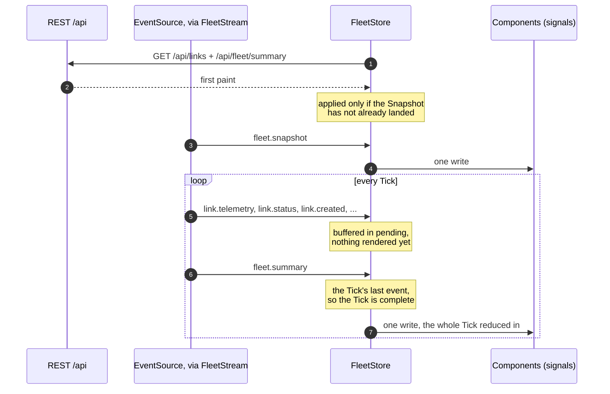

# console-data-access

The browser's state and its wires to the API. Everything a Console feature needs
to know about the fleet lives here; the feature libraries compose it, and the
presentational components in `console/ui` never inject it.

`FleetStore` is the single source of truth for the browser, written exactly once
per telemetry tick — the coalescing that makes a zoneless client comfortable at
1 Hz, because one tick costs one change-detection pass no matter how large the
fleet is. `fleet-stream` owns the SSE connection and its reconnect delay, and
takes its `EventSource` through the `EVENT_SOURCE` token so the async boundary
stays explicit and a test can drive it without a zone to flush. `applyListQuery`
keeps filter and sort state in the URL, so a view survives a reload and can be
shared. `AssistantSession` and `AssistantClient` own the panel's round trip, and
`AssistantInvalidPayloadError` is what tells a malformed Surface apart from a
transport failure.

That error class is why this library is declared a Module Federation singleton:
built into two bundles it would be two classes, and the `instanceof` check
distinguishing the two failure modes would silently stop matching.

What "exactly once per tick" looks like from the browser's side:

Two races are settled by that shape. The REST first paint and the Snapshot can
land in either order, so the store keeps a flag and lets the Snapshot win — the
stream is the fresher source, and first paint exists to fill the gap before it,
not to overwrite it. And a Transport Failure discards whatever is buffered
rather than applying it: a partial Tick left in `pending` would otherwise flush
*behind* the recovering Snapshot and paint a frame from before the gap over
current state.

Nothing here recomputes status. A dropped stream raises the stall banner and
freezes what is on screen; it never re-derives a Link to `down`, because an
operator has to be able to tell *the fleet died* from *my connection died*.

See the root [README](../../../README.md#8-how-it-works) for the end-to-end flow
this sits in the middle of, and
[ADR-0004](../../../docs/adr/0004-batched-per-tick-sse-framing.md) for why a
tick arrives as one frame.

## Running unit tests

Run `nx test console-data-access` to execute the unit tests.
