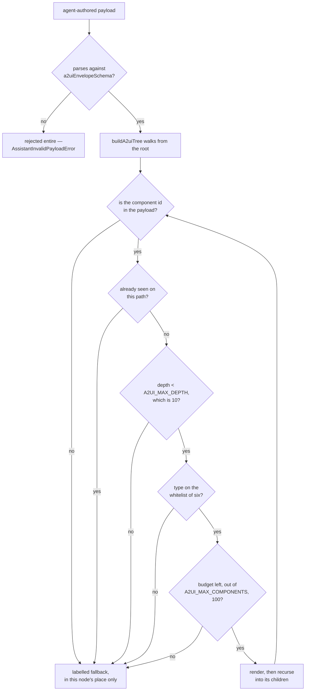

# console-ui

The Console's presentational components. Each one takes inputs and emits
outputs, injects no data-access service, and holds no knowledge of how the data
reached it — which is what lets a feature library compose them and a test render
them without a store.

`LinkForm` builds its validators from the shared schema rather than restating
the rules, so client validation and server validation cannot disagree.
`Sparkline` is a hand-rolled SVG chart with no charting dependency.
`StatusPill`, `ThroughputBar`, `SummaryFigure` and `FleetFilterBar` are the
fleet list's parts; `LinkConflict` is the surface an operator resolves a version
conflict on; `ConnectionBanner` and `OperatorMessage` are how a dropped stream
and a failed write become something a person can act on rather than a console
error.

`A2uiSurface` is the renderer for agent-authored panels: it maps a validated
payload onto this library's own whitelist of components, renders text through
interpolation only — never `innerHTML`, never `bypassSecurityTrust*` — and
labels an unknown component type instead of guessing.

Because that payload arrives from outside and drives a console that configures
live radio links, the path from it to the DOM is a security control rather than
a convenience. Every gate on that path:

The two failure modes are deliberately different in blast radius. A payload that
fails the schema is rejected whole, because a malformed envelope is not
something to partially trust. A node that fails any later gate degrades *in its
own place* — a labelled fallback — and its siblings still render, because one
bad branch in an agent's output should cost that branch and not the panel.

See the root [README](../../../README.md#7-project-structure) for the layering
rule, and [ADR-0007](../../../docs/adr/0007-own-a2ui-renderer.md) for why the
renderer lives here rather than coming from a package.

## Running unit tests

Run `nx test console-ui` to execute the unit tests.
