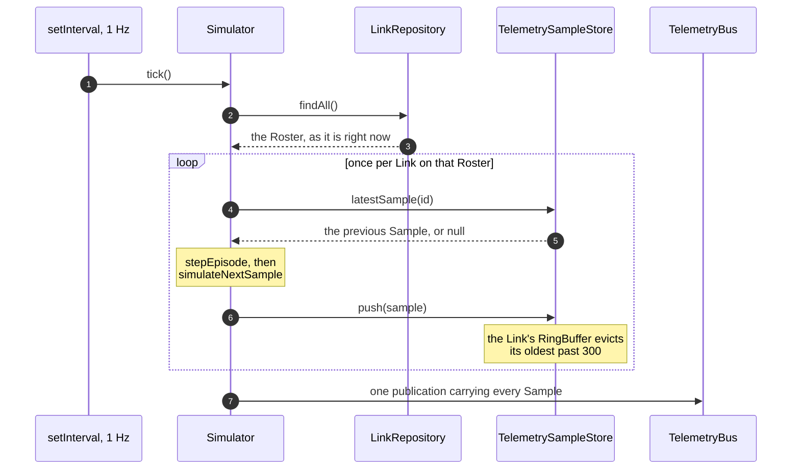

# server-telemetry

Where telemetry comes from and where it is kept. The `Simulator` produces one
sample per link per second with plausible drift and occasional degradation
episodes — there is no hardware, and this is the only source of samples in the
system.

`TelemetrySampleStore` holds a bounded ring buffer per link: 300 samples, five
minutes at 1 Hz, chosen to match the widest window the detail view can ask for.
Retention is bounded by capacity rather than by whatever window a client might
request, because a buffer sized to the most extravagant request ever made is the
unbounded growth a ring buffer exists to prevent. A client asking for an hour
receives the five minutes that exist — never an error, never padding.

`TelemetryBus` is the seam between producing samples and publishing them: the
simulator writes to the bus and knows nothing about SSE, and the stream layer
reads from the bus and knows nothing about how samples were made. `TelemetryPort`
is how the rest of the server asks for the latest sample without reaching into
the store, with `NoSampleTelemetryPort` for the case where none exists yet.
`selectWorstLinkId` picks the link the fleet summary points an operator at, and
`Clock` is injected so time is a dependency rather than an ambient fact.

One Tick, end to end:

The Roster read at step 2 happens on every Tick and is never cached, which is
what makes deleting a Link safe: the Link is simply absent from the next read,
so there is no ghost telemetry to prune and no cleanup path to forget. The
Degradation Episode map is rebuilt from that same read for the same reason.

Note what the bus does *not* do. It is an RxJS `Subject` — it carries a Tick and
derives nothing. Status and the KPI block are computed downstream, in
`SimulatorTelemetryPort.summary()` here and in `FleetEventStream` over in
[`server-stream-api`](../stream-api/README.md), both calling `deriveStatus` from
[`shared-domain`](../../shared/domain/README.md). The bus is the seam that keeps
sample *production* from knowing anything about how samples are published.

See the root [README](../../../README.md#8-how-it-works) for the end-to-end
flow, and
[ADR-0010](../../../docs/adr/0010-telemetry-retention-is-capacity-bounded.md)
for the retention bound.

## Running unit tests

Run `nx test server-telemetry` to execute the unit tests via [Vitest](https://vitest.dev/).
