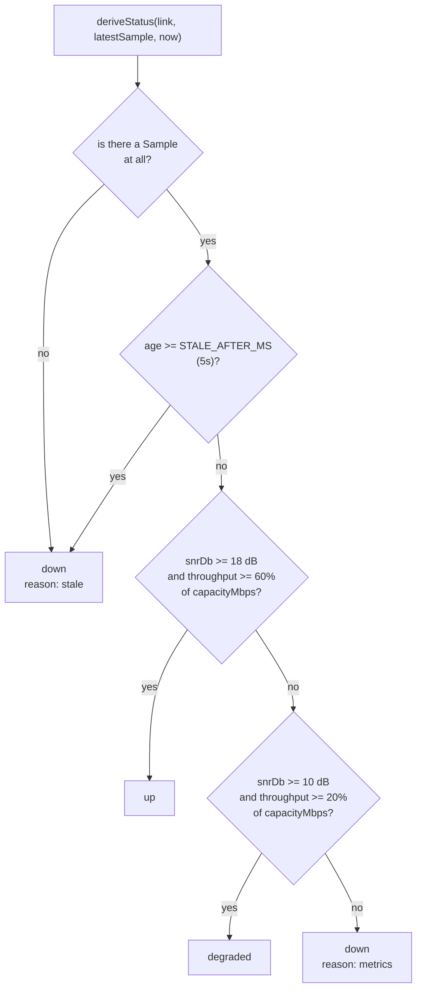

# shared-domain

The wire contract, owned in one place so the API and the Console cannot drift
apart: `Link` and its create/patch derivatives, `TelemetrySample`,
`FleetSummary`, the branded `LinkId`, the SSE event catalogue, and the error
vocabulary every failure is named from.

`deriveStatus` is the status rule itself — a pure function of a Link, its latest
sample, and the current time, which is why a Link's status is derived on the
server and never written by a client. `linkSchema` and its derivatives drive the
API's validation pipe, the OpenAPI document, and the Console's form validators
from the same declaration, so a bound like `capacityMbps` is stated once.
`sortLinks` and `matchesBandAndQuery` are the list rules, shared so the server
and an optimistic client agree on ordering.

The rule itself, thresholds and all:

Staleness is checked before the thresholds, and that order is the point: a
five-second-old Sample cannot testify that a Link is healthy *now*, however good
the numbers in it are. The two ways to be `down` stay distinguishable on the wire
because `LinkStatus` is a discriminated union carrying `reason` — `stale` means
nothing is arriving, `metrics` means readings are arriving and they are bad, and
an operator needs to tell those apart.

zod is the only runtime dependency this library has, and the only one it may
have: Nest, Angular and RxJS are banned imports here, which is what makes the
status rule testable without booting a framework.

See the root [README](../../../README.md#7-project-structure) for the dependency
rule this library sits at the bottom of, and
[ADR-0006](../../../docs/adr/0006-shared-zod-schema-as-the-contract.md) for why
one schema carries the contract on both sides of the wire.

## Running unit tests

Run `nx test shared-domain` to execute the unit tests via [Vitest](https://vitest.dev/).
